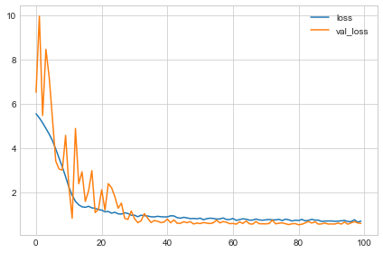

# Deep Learning
This dataset consists of physiochemical measurements from about 1600 Portuguese red wines. Also 
included is a quality rating for each wine from blind taste-tests. 
How well can we predict a wine's perceived quality from these measurements?
We have employed neural network to solve this problem. The neural network will entail the fine tuning explained in detail below.
Please see the CNN.py file for python code implementation.
### The Activation Function
An activation function is simply some function we apply to each of a layer's outputs (its activations). 
The most common is the rectifier function  max(0,x).
In this project we will use rectified linear unit or ReLU. Applying a ReLU activation to a linear unit means 
the output becomes max(0, w * x + b), where w is the weight, x is the value at node and b is bias.

### Building Sequential Models
We will use a sequential model which will connect together a list of layers in order from first to last: 
the first layer gets the input, the last layer produces the output. 

### The Loss Function
The loss function measures the disparity between the the target's true value and the value the model predicts.
In this case we will use mean absolute error or MAE. For each prediction y_pred, 
MAE measures the disparity from the true target y_true by an absolute difference abs(y_true - y_pred).

### The Optimizer - Stochastic Gradient Descent
The optimizer is an algorithm that adjusts the weights to minimize the loss.
They are iterative algorithms that train a network in steps. One step of training goes like this:

Sample some training data and run it through the network to make predictions.
Measure the loss between the predictions and the true values.
Finally, adjust the weights in a direction that makes the loss smaller.
This project will use Adam optimzer. Adam is an SGD algorithm that has an adaptive learning rate that makes it suitable for most problems without any parameter 
tuning (it is "self tuning", in a sense). Adam is a great general-purpose optimizer.

### Early Stopping
When a model is too eagerly learning noise, the validation loss may start to increase during training. To prevent this, we can simply stop the training whenever
it seems the validation loss isn't decreasing anymore. Interrupting the training this way is called early stopping.
Once we detect that the validation loss is starting to rise again, we can reset the weights back to where the minimum occured. 
This ensures that the model won't continue to learn noise and overfit the data.

### Dropout
To prevent the model from overfitting (a situation where a network is learning spurious patterns in the training data).
To recognize these spurious patterns a network will often rely on very a specific combinations of weight, a kind of "conspiracy" of weights. 
Being so specific, they tend to be fragile: remove one and the conspiracy falls apart.
o break up these conspiracies, we randomly drop out some fraction of a layer's input units every step of training, making it much harder 
for the network to learn those spurious patterns in the training data. Instead, it has to search for broad, general patterns, whose weight
patterns tend to be more robust.

### Batch Normalization
The next special layer we'll look at performs "batch normalization" (or "batchnorm"), 
which can help correct training that is slow or unstable.

### Results
Following the above fine tuning, the results for the loss function with training is below.

